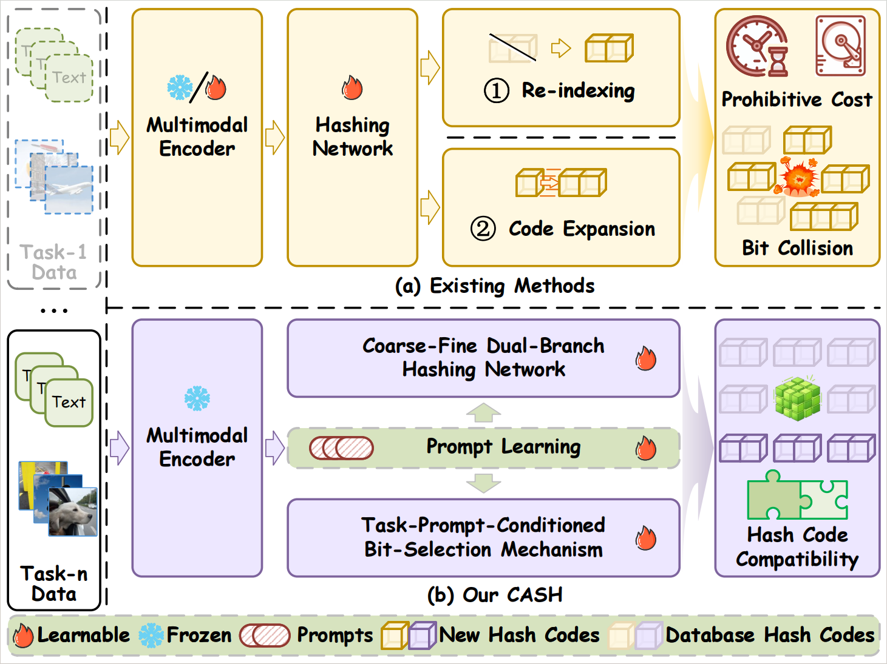
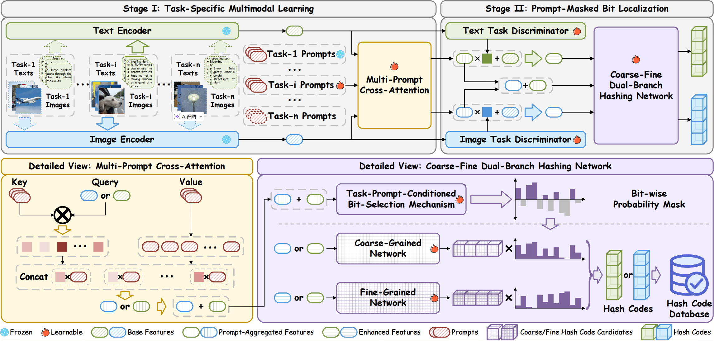

# CASH: Capacity-Aware Selective Hashing for Continual Cross-Modal Retrieval

Official PyTorch implementation of **“Do More with Less: Capacity-Aware Selective Hashing for Continual Cross-Modal Retrieval”** (TPAMI submission/manuscript).

## Abstract

Although cross-modal hashing enables efficient large-scale retrieval by encoding multimodal data into compact binary representations, its fixed code length and binary nature impose a fundamental capacity constraint that hinders continual adaptation to growing data streams and emerging semantic concepts. Existing continual cross-modal hashing methods typically resort to re-indexing or code expansion to accommodate new tasks, which either incur prohibitive computational costs or disrupt the consistency of the established Hamming space. More fundamentally, under a fixed bit budget, the continual accumulation of semantic information inevitably saturates the limited representation capacity, leading to intensified bit collisions and degraded neighborhood structures, and thereby exacerbating the stability-plasticity conflict that limits long-term retrieval performance. To address this, we propose **Capacity-Aware Selective Hashing (CASH)**, which significantly improves Hamming-space utilization through bit-level selective allocation under a fixed capacity budget, enabling stable continual learning while preserving long-term code compatibility. CASH employs a coarse-fine dual-branch hashing network to provide complementary global and fine-grained code candidates, and introduces a task-prompt-conditioned bit-selection mechanism that dynamically assigns each bit to the branch with the higher discriminative utility, effectively mitigating bit collisions and cross-task interference. To further ensure stability, the multimodal encoders are frozen, and incremental adaptation is achieved via lightweight task prompts. Extensive experiments under standard incremental protocols demonstrate that our CASH consistently outperforms SOTA baselines in both retrieval accuracy and long-term stability across task partition schemes.

## Method Summary (CASH)

CASH is designed around two key ideas:

- **Task-adaptive prompt learning for continual update**  
  We freeze the underlying feature representations and introduce **lightweight task prompts**. A **Multi-Prompt Cross-Attention** module injects task-specific context into multimodal features for incremental adaptation.

- **Capacity-aware selective hashing under fixed bits**  
  A **Coarse-Fine Dual-Branch Hashing Network** produces two complementary code candidates (coarse/global vs. fine-grained). A **prompt-conditioned mask** performs **bit-wise selection** between branches, allocating each bit to the branch that is more discriminative, mitigating collision growth and cross-task interference.

> Figures:  
> - `Figure1` (Intro/Abstract figure) illustrates the motivation and the core components.  
> - `Figure2` (Framework figure) details the two-stage pipeline and module-level design.  
>
> 
> 

## Repository Structure

```text
.
├── main.py        # entry point: sequential task training + evaluation
├── model.py       # CASH model: dual-branch hashing + prompts + mask + attention
├── train.py       # per-task training loop, validation, and continual evaluation
├── load_data.py   # dataloader + task-wise .mat feature loading
└── utils.py       # metrics (mAP@K), losses, logging, CSV dumping, seeding

```

## Datasets & Pre-trained CMH Models
1. Download datasets MSCOCO and NUSWIDE

```
MSCOCO-Balanced
url: https://pan.baidu.com/s/1uJ5DgDIJIBRownazZXOWnA?pwd=2025
code: 2026

NUSWIDE-Balanced
url: https://pan.baidu.com/s/17Rn92JwYELzV4YNQ2bndmg?pwd=2025
code: 2026

MSCOCO-Imbalance
url: https://pan.baidu.com/s/1gzUoMh3P-hH2iNysMxWSBA?pwd=2025
code: 2026

NUSWIDE-Imbalance
url: https://pan.baidu.com/s/1njmBa0j0EfeD_CzT0V4ZgA?pwd=2025
code: 2026
```

2. Change the value of `data_path` in file `main.py` to `/path/to/data`.

## Python Environment
``` bash
conda create -n CASH python=3.8
conda activate CASH
pip install -r requirements.txt
```

## Training
``` python
python main.py
```
