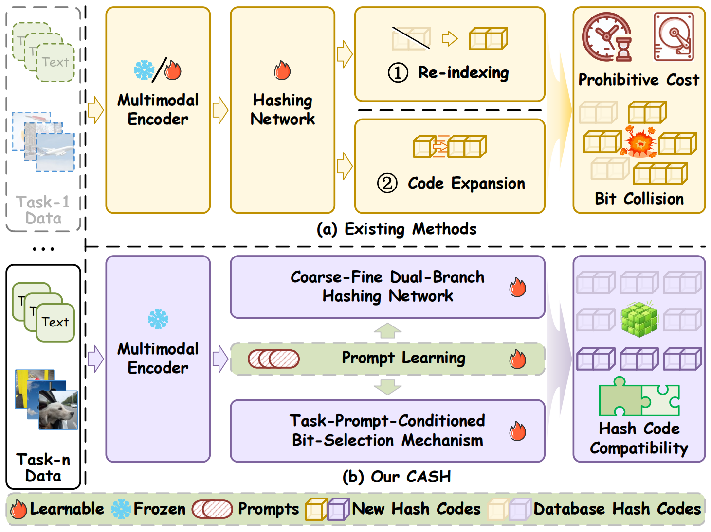
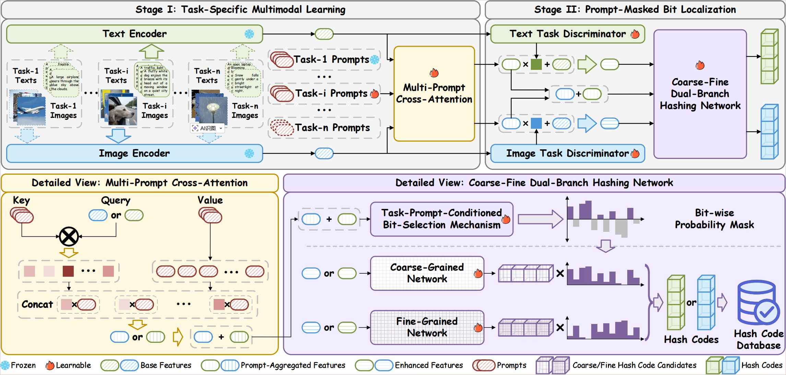

# CASH: Capacity-Aware Selective Hashing for Continual Cross-Modal Retrieval

[](#)
[](#)
[](#)
[](#)

Official PyTorch implementation of **“Do More with Less: Capacity-Aware Selective Hashing for Continual Cross-Modal Retrieval”** (TPAMI submission/manuscript).

---

## 🧭 Table of Contents

- [🖼️ Figures](#️-figures)
- [📝 Abstract](#-abstract)
- [🧠 Overview](#-overview)
- [🗂️ Repository Structure](#️-repository-structure)
- [📦 Datasets](#-datasets)
- [🛠️ Requirements](#️-requirements)
- [🚀 Quick Start](#-quick-start)
- [🎛️ Key Arguments](#️-key-arguments)
- [📈 Outputs](#-outputs)
- [♻️ Reproducibility Notes](#️-reproducibility-notes)

---
## 🖼️ Figures

### Abstract Overview

<p align="center">
  
  <br>
  <em><strong>Figure 1.</strong> Abstract overview: motivation and core components.</em>
</p>

---

### Framework

<p align="center">
  
  <br>
  <em><strong>Figure 2.</strong> Framework: two-stage pipeline and module-level design.</em>
</p>

---

## 📝 Abstract

Although cross-modal hashing enables efficient large-scale retrieval by encoding multimodal data into compact binary representations, its fixed code length and binary nature impose a fundamental capacity constraint that hinders continual adaptation to growing data streams and emerging semantic concepts. Existing continual cross-modal hashing methods typically resort to re-indexing or code expansion to accommodate new tasks, which either incur prohibitive computational costs or disrupt the consistency of the established Hamming space. More fundamentally, under a fixed bit budget, the continual accumulation of semantic information inevitably saturates the limited representation capacity, leading to intensified bit collisions and degraded neighborhood structures, and thereby exacerbating the stability-plasticity conflict that limits long-term retrieval performance. To address this, we propose **Capacity-Aware Selective Hashing (CASH)**, which significantly improves Hamming-space utilization through bit-level selective allocation under a fixed capacity budget, enabling stable continual learning while preserving long-term code compatibility. CASH employs a coarse-fine dual-branch hashing network to provide complementary global and fine-grained code candidates, and introduces a task-prompt-conditioned bit-selection mechanism that dynamically assigns each bit to the branch with the higher discriminative utility, effectively mitigating bit collisions and cross-task interference. To further ensure stability, the multimodal encoders are frozen, and incremental adaptation is achieved via lightweight task prompts. Extensive experiments under standard incremental protocols demonstrate that our CASH consistently outperforms SOTA baselines in both retrieval accuracy and long-term stability across task partition schemes.

---


## 🧠 Overview

Overview of the proposed CASH framework.

- *Stage I: Task-Specific Multimodal Learning.*  
  The multimodal encoders are frozen, and task-specific prompts are introduced for each task. Multi-prompt cross-attention aggregates multiple prompt tokens to enrich features for each modality.

- *Stage II: Prompt-Masked Bit Localization.*  
  Task discriminators gate residual prompt injection and feed enhanced features into the coarse-fine dual-branch hashing network. A task-prompt-conditioned bit-selection mechanism predicts a bit-wise probability mask to fuse coarse and fine hash code candidates on a per-bit basis, yielding fixed-length multimodal hash codes that are appended to a unified database for continual cross-modal retrieval.

---

## 🗂️ Repository Structure

```text
.
├── main.py        # entry point: sequential task training + evaluation
├── model.py       # CASH model: dual-branch hashing + prompts + mask + attention
├── train.py       # per-task training loop, validation, and continual evaluation
├── load_data.py   # dataloader + task-wise .mat feature loading
└── utils.py       # metrics (mAP@K), losses, logging, CSV dumping, seeding

```
---
## 📦 Datasets

1. Download datasets (MSCOCO and NUSWIDE)

```text
MSCOCO-Balanced
url: https://pan.baidu.com/s/1d43aIScpKsoxgPucVLfXzg?pwd=2026
code: 2026

NUSWIDE-Balanced
url: https://pan.baidu.com/s/12vnyVsIa-sKVkm69E3m57w?pwd=2026
code: 2026

MSCOCO-Imbalance
url: https://pan.baidu.com/s/1rvkp5XturvLCITIr0d-Cjw?pwd=2026
code: 2026

NUSWIDE-Imbalance
url: https://pan.baidu.com/s/1islyOdA4kbXVwebtdToQiw?pwd=2026
code: 2026
```

---

2. Set the dataset root path (recommended via command line), or change the value of `data_path` in `main.py` to `/path/to/data`.

---

3. Dataset Partition Protocols

The following table summarizes the task partition settings used in our continual cross-modal retrieval experiments on **MSCOCO** and **NUSWIDE**. For each dataset, we report the number of **query**, **training**, and **database** samples, together with the corresponding **semantic categories** assigned to each incremental task. We consider both **balanced** and **imbalanced** partition protocols. In the balanced setting, categories are distributed more evenly across tasks to provide a relatively uniform incremental stream; in the imbalanced setting, task sizes vary significantly to better simulate realistic non-stationary data arrival. Specifically, **MSCOCO** is divided into **5 tasks with 16 categories per task**, while **NUSWIDE** is divided into **5 tasks with 16/16/16/16/17 categories**, respectively. Unless otherwise stated, all experiments follow these predefined task splits for fair comparison and reproducibility.

<table>
  <tr>
    <th>Datasets</th>
    <th>Partition</th>
    <th>Subset</th>
    <th>Task 1</th>
    <th>Task 2</th>
    <th>Task 3</th>
    <th>Task 4</th>
    <th>Task 5</th>
  </tr>

  <!-- MSCOCO -->
  <tr>
    <td rowspan="8">MSCOCO<br>16/16/16/16/16</td>
    <td rowspan="4">Balanced</td>
    <td>Query Samples</td>
    <td>600</td>
    <td>600</td>
    <td>600</td>
    <td>600</td>
    <td>600</td>
  </tr>
  <tr>
    <td>Training Samples</td>
    <td>2,402</td>
    <td>2,250</td>
    <td>2,313</td>
    <td>2,620</td>
    <td>2,558</td>
  </tr>
  <tr>
    <td>Database Samples</td>
    <td>6,605</td>
    <td>6,224</td>
    <td>6,382</td>
    <td>7,150</td>
    <td>6,996</td>
  </tr>
  <tr>
    <td>Categories</td>
    <td>bicycle, car, bus, train, fire hydrant, stop sign, bench, cat, sheep, tennis racket, bottle, knife, orange, carrot, tv, keyboard</td>
    <td>person, dog, suitcase, snowboardbaseball bat, baseball glove, wine glass, spoon, apple, donut, bed, laptop, remote, microwave, toaster, book</td>
    <td>truck, boat, traffic light, horse, elephant, handbag, frisbee, sports ball, cup, pizza, cake, potted plant, clock, vase, scissors, hair drier</td>
    <td>airplane, bird, tie, skis, kite, surfboard, fork, bowl, hot dog, couch, toilet, oven, sink, refrigerator, teddy bear, toothbrush</td>
    <td>motorcycle, parking meter, cow, bear, zebra, giraffe, backpack, umbrella, skateboard, banana, sandwich, hot dog, chair, couch, dining table, cell phone</td>
  </tr>
  <tr>
    <td rowspan="4">Imbalanced</td>
    <td>Query Samples</td>
    <td>2,124</td>
    <td>956</td>
    <td>116</td>
    <td>484</td>
    <td>437</td>
  </tr>
  <tr>
    <td>Training Samples</td>
    <td>7,647</td>
    <td>3,444</td>
    <td>418</td>
    <td>1,743</td>
    <td>1,574</td>
  </tr>
  <tr>
    <td>Database Samples</td>
    <td>19,118</td>
    <td>8,611</td>
    <td>1,046</td>
    <td>4,357</td>
    <td>3,934</td>
  </tr>
  <tr>
    <td>Categories</td>
    <td>person, bicycle, car, motorcycle, airplane, bus, train, truck, boat, traffic light, fire hydrant, stop sign, parking meter, bench, bird, cat</td>
    <td>dog, horse, sheep, cow, elephant, bear, zebra, giraffe, backpack, umbrella, handbag, tie, suitcase, frisbee, skis, snowboard</td>
    <td>sports ball, kite, baseball bat, baseball glove, skateboard, surfboard, tennis racket, bottle, wine glass, cup, fork, knife, spoon, bowl, banana, apple</td>
    <td>sandwich, orange, orange, carrot, hot dog, pizza, donut, cake, chair, couch, potted plant, bed, dining table, toilet, tv, laptop</td>
    <td>mouse, remote, keyboard, cell phone, microwave, oven, toaster, sink, refrigerator, book, clock, vase, scissors, teddy bear, hair drier, toothbrush</td>
  </tr>

  <!-- NUSWIDE -->
  <tr>
    <td rowspan="8">NUSWIDE<br>16/16/16/16/17</td>
    <td rowspan="4">Balanced</td>
    <td>Query Samples</td>
    <td>2,124</td>
    <td>956</td>
    <td>116</td>
    <td>484</td>
    <td>437</td>
  </tr>
  <tr>
    <td>Training Samples</td>
    <td>7,647</td>
    <td>3,444</td>
    <td>418</td>
    <td>1,743</td>
    <td>1,574</td>
  </tr>
  <tr>
    <td>Database Samples</td>
    <td>19,118</td>
    <td>8,611</td>
    <td>1,046</td>
    <td>4,357</td>
    <td>3,934</td>
  </tr>
  <tr>
    <td>Categories</td>
    <td>book, elk, fire, flags, flowers, fox, frost, nighttime, ocean, person, reflection, sign, snow, soccer, toy, train</td>
    <td>beach, bear, bridge, clouds, cow, dancing, earthquake, fish, house, military, plants, sports, sun, temple, whales, window</td>
    <td>airport, boats, cat, computer, glacier, map, mountain, railroad, rainbow, road, rocks, sky, statue, sunset, tree, valley</td>
    <td>castle, dog, food, garden, harbor, leaf, moon, plane, police, sand, swimmers, tower, town, water, waterfall, wedding</td>
    <td>animal, birds, buildings, cars, cityscape, coral, grass, horses, lake, protest, running, street, surf, tattoo, tiger, vehicle, zebra</td>
  </tr>
  <tr>
    <td rowspan="4">Imbalanced</td>
    <td>Query Samples</td>
    <td>1,796</td>
    <td>1,489</td>
    <td>1,252</td>
    <td>2,261</td>
    <td>1,602</td>
  </tr>
  <tr>
    <td>Training Samples</td>
    <td>6,469</td>
    <td>5,363</td>
    <td>4,508</td>
    <td>8,140</td>
    <td>5,768</td>
  </tr>
  <tr>
    <td>Database Samples</td>
    <td>16,172</td>
    <td>13,407</td>
    <td>11,269</td>
    <td>20,349</td>
    <td>14,419</td>
  </tr>
  <tr>
    <td>Categories</td>
    <td>airport, animal, beach, bear, birds, boats,book, bridge, buildings, cars, castle, cat, cityscape, clouds, computer, coral</td>
    <td>cow, dancing, dog, earthquake, elk, fire, fish, flags, flowers, food, fox, frost, garden, glacier, grass, harbor</td>
    <td>horses, house, lake, leaf, map, military, moon, mountain, nighttime, ocean, person, plane, plants, police, protest, railroad</td>
    <td>rainbow, reflection, road, rocks, running, sand, sign, sky, snow, soccer, sports, statue, street, sun, sunset, surf</td>
    <td>swimmers, tattoo, temple, tiger, tower, town, toy, train, tree, valley, vehicle, water, waterfall, wedding, whales, window, zebra</td>
  </tr>
</table>

---

## 🛠️ Requirements

### Environment

* Python 3.8+
* CUDA is recommended for training

---

### Install dependencies

If your `requirements.txt` is a **Conda export file** (e.g., generated by `conda list --export`), install via:

```bash
conda create -n cash --file requirements.txt
conda activate cash
```

> Note: If you need a CUDA-enabled PyTorch build, install PyTorch according to your CUDA version (official installer recommended).

---

## 🚀 Quick Start

### 1) Prepare data (placeholder)

Put dataset files under:

```text
<data_path>/<dataset_name>/
```

The loader expects **task-wise** `.mat` feature files (image/text).

> Note: Current code assumes **512-d** pre-extracted features for both image/text and uses `feature_dim=512`.

---

### 2) Train & Evaluate (continual protocol)

Run sequential continual training over `num_tasks` tasks (default: 5) and evaluate:

* per-task retrieval,
* task-averaged performance,
* all-tasks evaluation (concatenated test) depending on the setting.

Example:

```bash
python main.py \
  --data_path /path/to/data \
  --output_dir ./outputs \
  --dataset_name MSCOCO \
  --bit 16 \
  --prompt_mode share \
  --runid exp_coco_16b
```

---

## 🎛️ Key Arguments

* `--dataset_name`: `MSCOCO` / `NUSWIDE` (and `*_NoMean` variants if used in your setup)
* `--num_tasks`: number of incremental tasks (default: 5)
* `--bit`: hash length (e.g., 16/32/64/128/256)
* `--prompt_mode`: `share` or `separate`

  * `share`: one prompt list shared across modalities
  * `separate`: separate prompt lists for image/text
* `--prompt_length`: prompt token length
* `--learning_rate`: base LR (later tasks use a smaller extended LR internally)
* `--old_dataset_code_is_useful`:

  * `True`: reuse previously stored database codes to avoid re-encoding and keep strict compatibility
  * `False`: (more expensive) re-encode concatenated data for evaluation

---

## 📈 Outputs

All outputs are saved under `--output_dir` with subfolders:

* `checkpoints/<runid>/`: model checkpoint + cached historical hash codes
* `logs/<runid>/`: training/validation logs
* `csv_result/<runid>/`: CSV matrices for I→T and T→I results across tasks

Evaluation metric: **mAP@1000** for:

* image-to-text retrieval (I→T)
* text-to-image retrieval (T→I)

---

## ♻️ Reproducibility Notes

* Set a fixed seed via `--seed` for determinism where possible.
* Adjust GPU selection as needed (see `CUDA_VISIBLE_DEVICES` in `main.py`).
* For fair comparisons, keep the same task partition protocol and feature extraction setting as described in the paper.
